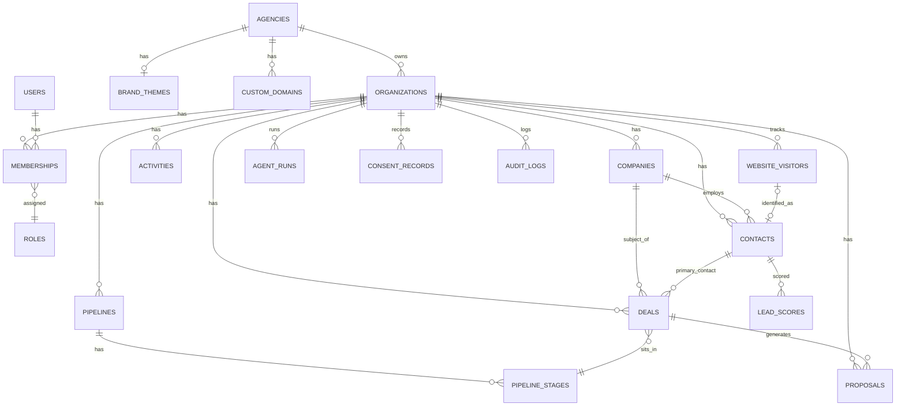

# 03 — Database Architecture

Postgres via Supabase, single project per environment, EU region. Shared schema, Row Level Security (RLS) enforced multi-tenancy. All tables use `uuid` primary keys (`gen_random_uuid()`) and `created_at`/`updated_at` timestamps (`timestamptz`).

**Deletion model — two tiers, not one.** `deleted_at` (soft-delete) is used on ordinary user-facing CRM entities (`contacts`, `companies`, `deals`, `proposals`, `activities`) for recoverable, user-initiated deletion — a "trash" model, filtered from default views but still physically present. **This is never sufficient to satisfy a GDPR erasure request.** A completed `data_subject_requests` row (`§2.8`) always performs actual hard deletion of the row, or irreversible column-level anonymization where the row must survive for referential/audit reasons (e.g., an `activities` row tied to a deal stays, but its `subject`/`body` text referencing the erased contact is overwritten, not just hidden behind `deleted_at`). Anywhere this document says "soft-delete," read it as the ordinary-use mechanism only; the compliance cascade in §2.8 and `08-Security.md` §5 governs actual erasure and is never implemented as "set `deleted_at`."

## 1. Core ERD (tenancy + CRM domain)



The full field-level ERD (all 45+ tables, including the Brain, Agent, and platform-infrastructure tables in §2.9-2.10) is generated automatically from `packages/database/schema` once implemented (Supabase CLI `db diagram` / dbdocs). This document is the authoritative source of truth until that generation pipeline exists.

## 2. Schema by Domain

Each domain grouping below is owned by the correspondingly-named package in `02-Software-Architecture.md` §4: `packages/tenancy` (Tenancy & Identity), `packages/crm`, `packages/intelligence`, `packages/automation` (Automation), `packages/revenue` (Revenue, and — filtered to the portal caller's scope — Customer Portal data access), `packages/ai-agents`, `packages/brain`, `packages/auth` (including Customer Portal session/auth), `packages/compliance`.

### 2.1 Tenancy & Identity

| Table | Key Columns | Notes |
|---|---|---|
| `agencies` | `id`, `name`, `slug` (unique), `subdomain` (unique), `plan`, `stripe_customer_id`, `status` | Root of the reseller hierarchy. `NULL` agency = platform-direct customer only exists at the `organizations` level |
| `organizations` | `id`, `agency_id` (fk, nullable), `name`, `slug` (unique), `industry`, `timezone`, `plan`, `stripe_customer_id`, `status` (`active`/`suspended`/`churned`) | The tenant. Every tenant-scoped table carries `organization_id` |
| `users` | `id` (= `auth.users.id`), `email`, `full_name`, `avatar_url`, `default_organization_id` | 1:1 with Supabase Auth identity |
| `memberships` | `id`, `user_id` (fk), `organization_id` (fk, **nullable**), `agency_id` (fk, **nullable**), `role_id` (fk), `status` (`invited`/`active`/`removed`) | Join table; a user can belong to multiple organizations (e.g. agency staff) *and/or* hold an agency-level membership. Exactly one of `organization_id`/`agency_id` is set per row, enforced by a `CHECK` constraint — never both, never neither (M1.4, ADR-005) |
| `roles` | `id`, `key` (`agency_owner`,`agency_admin`,`org_admin`,`org_member`,`org_viewer`,`portal_customer`), `permission_set` (jsonb) | Seeded, rarely mutated at runtime |
| `brand_themes` | `id`, `agency_id` (fk, unique), `logo_url`, `favicon_url`, `primary_color_light`/`_dark`, `secondary_color_light`/`_dark`, `accent_color_light`/`_dark`, `font_family` | Inherited by all of an agency's organizations unless overridden. Every overridable color has separate light/dark variants (`07-UI-UX-System.md` §2/§3), not a single value each |
| `custom_domains` | `id`, `agency_id` (fk), `domain`, `verification_status`, `verified_at`, `ssl_status` | Schema only as of M1.4; verification/SSL automation is Phase 7 (`09-Development-Roadmap.md`) |
| `api_keys` | `id`, `organization_id`, `name`, `key_hash`, `key_prefix` (`arev_live_`/`arev_test_`), `scopes` (jsonb), `created_by`, `last_used_at`, `revoked_at` | Backs the API key auth model in `04-API-Architecture.md` §3 — hashed at rest (SHA-256), never stored plaintext, individually revocable, scoped independently of the issuing user's own role. **M1.7**: table exists and a key can be issued (internal script only, `04-API-Architecture.md` §2.3), but nothing authenticates against it yet. **Milestone 3.3**: request-handling now does — `resolve_api_key()` (below) plus `packages/auth`'s `resolveServiceActorFromApiKey` validate a presented key and resolve its `organization_id`/`scopes`; still no self-service `/api/v1/api-keys` management route, issuance remains the internal script only. `resolve_api_key(p_key_hash text) returns table(api_key_id uuid, organization_id uuid, scopes jsonb)` (`SECURITY DEFINER`, `20260901090400`) — single atomic `UPDATE ... SET last_used_at = now() ... RETURNING`, mirrors `resolve_tracking_site()`'s own no-`auth.uid()`-guard precedent (a machine credential has no session identity to check); returns zero rows, never a distinguishable error, for a nonexistent, revoked, or hash-mismatched key |

### 2.2 CRM

| Table | Key Columns | Notes |
|---|---|---|
| `companies` | `id`, `organization_id`, `name`, `domain`, `industry`, `employee_count`, `annual_revenue`, `linkedin_url`, `enrichment_status`, `owner_id`, `deleted_at` | |
| `contacts` | `id`, `organization_id`, `company_id` (fk, nullable), `first_name`, `last_name`, `email`, `phone`, `job_title`, `linkedin_url`, `lifecycle_stage` (enum), `owner_id`, `deleted_at` | `email` unique per `organization_id` |
| `deals` | `id`, `organization_id`, `company_id`, `primary_contact_id`, `pipeline_id`, `stage_id`, `amount`, `currency`, `probability`, `expected_close_date`, `status` (`open`/`won`/`lost`), `owner_id`, `deleted_at` | |
| `activities` | `id`, `organization_id`, `type` (`call`/`email`/`meeting`/`note`/`task`), `related_to_type`, `related_to_id` (nullable), `subject`, `body`, `due_at`, `completed_at`, `created_by`, `deleted_at` | Polymorphic association via `related_to_type`/`related_to_id` (Milestone 2.3A). `related_to_id` is nullable at the DB level solely for GDPR contact erasure — ordinary create/update always supplies it, enforced at the domain layer, not a DB `NOT NULL`/`CHECK` (§2.8) |
| `notes` | `id`, `organization_id`, `related_to_type`, `related_to_id` (nullable), `body` (nullable), `created_by`, `deleted_at` | Same GDPR-driven nullability as `activities` (Milestone 2.3A) |
| `tags` / `taggings` | `tags(id, organization_id, name, color, deleted_at)`; `taggings(id, organization_id, tag_id, taggable_type, taggable_id)` | Generic tagging across contacts/companies/deals (Milestone 2.3A). `taggings` carries its own `organization_id` (RLS has no other way to derive tenancy) and is the one CRM table that is physically hard-deleted rather than soft-deleted — no `deleted_at`, deliberate exception, §5 |
| `pipelines` | `id`, `organization_id`, `name`, `is_default` | |
| `pipeline_stages` | `id`, `pipeline_id`, `name`, `sort_order`, `probability`, `is_won_stage`, `is_lost_stage` | |

### 2.3 Intelligence

**Milestone 3.1A implementation note**: `tracking_sites` (new) and the schema for `website_visitors`/`visitor_sessions`/`visitor_events` below shipped as schema-only in Milestone 3.1A — no ingestion endpoint, tracking script, consent-record endpoint, rate limiting, or visitor-identification logic exist yet (see `docs/13-Technical-Design-Review.md` "Milestone 3.1A"). `visitor_sessions`/`visitor_events` gained an `organization_id` column beyond this table's own original one-line spec below, which never listed one — a genuine, reported discrepancy, not a silent deviation: every other high-volume child table in this repository needing a tenant-safety composite FK to its parent (`activities`, `notes`, `taggings`, `pipeline_stages`, `deals`) denormalizes `organization_id` onto the child row specifically to make that composite FK possible, and a plain `session_id`/`tracking_site_id`/`visitor_id` FK alone would provide zero structural tenant-safety guarantee independent of RLS. Both tables gained `organization_id` to close that gap, applying an already-established pattern, not inventing a new one.

**Milestone 3.1B prerequisite note (database-layer only — `packages/intelligence` itself does not exist yet)**: the 3.1B pre-implementation audit found two blockers empirically, not theoretically, before any domain code was written (`docs/13-Technical-Design-Review.md` "Milestone 3.1B"). First, `consent_records`' own RLS (`org_admin`-only `SELECT`, `20260810100100_enable_compliance_rls.sql`) makes the table completely unreadable to the role-less anonymous-ingestion pathway — proven by seeding a real `granted` row and confirming a role-less, organization-scoped-only read returned zero rows. Closed by a narrow `SECURITY DEFINER` function, `check_visitor_cookie_tracking_consent(organization_id, anonymous_id) returns boolean` (`20260820100100`), which does **not** loosen or bypass `consent_records`' existing `org_admin`-only policies for any other caller — it is an additional, minimal, boolean-only read path, the same security class as `resolve_tracking_site()` (no `auth.uid()` guard, by the identical deliberate design). Second, no documentation anywhere in this repository specified visitor-session identity/continuity semantics; approved resolution: session identity is a **client-generated opaque UUID** (`anonymous_session_id`, generated by the future tracking script, 3.1D) — never an organization identifier, never an authorization credential, never trusted for tenant selection, never a database primary key (`visitor_sessions.id` remains the real, server-generated PK). `visitor_sessions` gained `anonymous_session_id uuid not null` plus `UNIQUE (organization_id, tracking_site_id, visitor_id, anonymous_session_id)` (`20260820100000`) as an **additive follow-up migration** — the original 3.1A migration was not edited, since `visitor_sessions` had zero rows in any environment this milestone has touched. `packages/intelligence`'s own domain layer (the actual 3.1B implementation — resolve-or-create session logic, the atomic ingest transaction) remains unbuilt.

**Milestone 3.1C-A note — consent write path**: `check_visitor_cookie_tracking_consent()` above is read-only; the companion write path is `record_visitor_cookie_tracking_consent(p_site_key uuid, p_anonymous_id uuid, p_status text) returns boolean` (`SECURITY DEFINER`, `EXECUTE` granted to `authenticated` only). Takes `p_site_key`, never `organization_id` directly — `organization_id` is resolved internally from `tracking_sites`, mirroring `resolve_tracking_site()`'s own precedent, making cross-tenant forgery structurally impossible rather than merely checked. Writes to `consent_records` with a fixed `subject_type='visitor'`/`consent_type='cookie_tracking'`/`source='tracking_script'`, append-only (a withdrawal is a new row, matching this table's existing doctrine); returns `false` without writing anything if the site key does not resolve to a live, non-revoked tracking site. Now live behind `POST /track/consent` (Milestone 3.1C-C) and the browser tracking script's `consent()` API (Milestone 3.1D).

**Milestone 3.2 note — visitor identification (delivered)**: `website_visitors` gained one additive column, `identification_suppressed_at timestamptz` (`20260821090000`) — set once, permanently, by the contact-erasure anti-relink mechanism (3.2F) when the contact a visitor was linked to is hard-erased; non-null makes that visitor row permanently ineligible for any future identification, to any contact. `visitor_identifications` and `tracking_site_public_keys` (both new, 3.2A) are documented in their own table rows below. Identification is orchestrated in TypeScript (`packages/intelligence`'s `identifyVisitor`) across multiple statements inside one `withTenantContext` transaction — the same composition style `ingestTrackingEvent` already uses — with one exception: the `visitor.identified` transactional-outbox write goes through a dedicated `SECURITY DEFINER` function, `emit_visitor_identified_event(p_website_visitor_id uuid, p_contact_id uuid) returns void` (`20260821090500`, hardened during the Milestone 3.2 acceptance-audit remediation pass). That function takes no `organization_id` parameter — it derives it from `website_visitors` and independently re-proves the visitor's current `identified_contact_id` equals the supplied contact, and that the contact belongs to the same organization, before inserting; any mismatch is a silent no-op, never an exception (it does not independently re-check `identification_suppressed_at` or `contacts.deleted_at` — a known, accepted defense-in-depth gap, not currently reachable via any real call path; see `docs/13-Technical-Design-Review.md` "Milestone 3.2 — Overall Closeout"). `emit_visitor_identified_event` is not idempotent at the SQL layer — repeated direct calls for the same currently-valid binding create repeated events; the function has no external (PostgREST/RPC) attack surface, since this codebase never exposes Postgres functions directly to browser clients. Public write path: `POST /track/identify` (Milestone 3.2D, `docs/04-API-Architecture.md`). Staff key management: `GET/POST /api/v1/tracking-sites/{trackingSiteId}/public-keys` and `POST .../public-keys/{keyId}/revoke` (Milestone 3.2B, `tracking:manage-identity-keys` permission, `org_admin` only). The identity-trust model is Ed25519 asymmetric signing, not the HMAC/shared-secret design originally considered — see `docs/08-Security.md` §4.1 "Visitor Identification — Ed25519 Trust Model" for the full architecture-amendment rationale.

**Milestone 3.3 note — lead enrichment (delivered, AI Revenue OS side)**: `company_enrichment`/`contact_enrichment` (3.3A, below) are the real, shipped shape — replacing this document's own earlier, never-implemented placeholder columns. Written by `recordEnrichmentResult` (`packages/intelligence`), the one write path for a provider result: a live re-check of the target entity (existence, `deleted_at IS NULL`) inside the same transaction as the write, then a monotonic upsert (strict `fetched_at >`, never overwriting a newer or equally-fresh stored result), then `workflow_runs` completion bookkeeping (§2.5). This platform never holds a provider credential or calls a provider directly — n8n does, on its own side, then pushes an already-normalized result back to `POST /api/v1/contacts/{id}/enrichment`/`.../companies/{id}/enrichment` (`docs/04-API-Architecture.md` §2.8), API-key-authenticated (`enrichment:write` scope, see `api_keys` above). The trigger side (`visitor.identified` → an n8n webhook call) is the cron-driven dispatcher documented in §2.10 below.

**Milestone 3.4 note — deterministic, rules-based lead scoring (delivered)**: `lead_scores`/`scoring_rules` (below) are the real, shipped shape — replacing this document's own earlier, never-implemented placeholder columns. Contact-level only, no company-level score. A rule is a strict, allowlisted `{field, operator, value}` triple evaluated by a fixed TypeScript interpreter (`packages/intelligence/src/scoring.ts`) — never an executable expression, never `eval`/`new Function`/dynamic SQL, no LLM/agent involvement anywhere in this milestone (`08-Security.md` §2.1). Triggered two ways: a dispatcher `EventConsumer` (`lead_scoring`) on `visitor.identified`, and a post-enrichment recalculation hook inside `recordEnrichmentResult` with a durable, automatically-retried recovery path via `workflow_runs` (§2.5 below) — see `02-Software-Architecture.md` §5's own Milestone 3.4 note and `04-API-Architecture.md` §2.9 for the staff API surface.

| Table | Key Columns | Notes |
|---|---|---|
| `tracking_sites` | `id`, `organization_id`, `label`, `created_by`, `created_at`, `revoked_at` | **New, Milestone 3.1A.** `id` is the public tracking-site identifier itself — intentionally public, non-secret, meant to be embedded in a customer's browser-served JavaScript once the tracking script ships (3.1D). Deliberately not hashed at rest: unlike `api_keys.key_hash`, this value has no confidentiality to protect, since it is published in every installing customer's page source by design — its security properties are unguessability (`gen_random_uuid()`) and narrow scope (`resolve_tracking_site()`, below, returns an `organization_id` and nothing else), not secrecy. Multiple rows per organization are supported (one per tenant property/site); rotation is a new row plus revoking the old one, never mutating `id` in place. `resolve_tracking_site(uuid) returns table(organization_id uuid)` (`SECURITY DEFINER`) resolves this identifier to its owning organization before tenant context exists — the one function in this schema with no `auth.uid()` caller-identity guard, by design, since a public tracking beacon has no authenticated identity to check; its authorization primitive is possession of the identifier itself. `EXECUTE` is granted to `authenticated` only (the application backend's own uniform connection role for every request — there is no direct `anon`-to-Postgres path in this architecture); `PUBLIC`/`anon` have zero `EXECUTE`. |
| `website_visitors` | `id`, `organization_id`, `anonymous_id`, `identified_contact_id` (composite fk to `contacts`, nullable), `identification_suppressed_at` (nullable, added 3.2A), `first_seen_at`, `last_seen_at` | Anonymous until identification resolves a contact — **live as of Milestone 3.2** via `POST /track/identify` and `packages/intelligence`'s `identifyVisitor`. `anonymous_id` is a client-generated (`crypto.randomUUID()`) opaque identifier — also the value `consent_records.subject_id` holds for `subject_type='visitor'`; `consent_records.subject_id` has no FK, so a consent grant can exist for an `anonymous_id` before any row here does. `UNIQUE (organization_id, anonymous_id)` — the same `anonymous_id` may independently exist in two different organizations with no collision. `identification_suppressed_at`: see the Milestone 3.2 note above. |
| `visitor_sessions` | `id`, `organization_id` (added 3.1A, see note above), `visitor_id` (composite fk to `website_visitors`), `tracking_site_id` (composite fk to `tracking_sites`, not null), `anonymous_session_id` (added 3.1B prerequisite, not null), `started_at`, `ended_at`, `referrer`, `utm_source/medium/campaign`, `landing_page`, `device_type` | `tracking_site_id` is `NOT NULL` — every session originates from a resolved tracking credential. `anonymous_session_id` is a client-generated opaque correlation UUID (generated by the 3.1D tracking script) — not an organization identifier, not a credential, not a primary key; scoped for race-safe resolve-or-create by `UNIQUE (organization_id, tracking_site_id, visitor_id, anonymous_session_id)` (`visitor_sessions_org_site_visitor_session_key`) — the same value may independently, legitimately repeat across different organizations/sites/visitors. Session identity is persisted browser-side in `sessionStorage` (standard per-tab lifetime, no custom inactivity/timeout heuristic — Milestone 3.1D's own design resolution). Ingestion write path (`POST /track/collect`, Milestone 3.1C-C) is live as of Milestone 3.1's close. |
| `visitor_events` | `id`, `organization_id` (added 3.1A, see note above), `session_id` (composite fk to `visitor_sessions`), `event_type` (`pageview`/`form_submit`/`click`), `url`, `metadata` (jsonb), `occurred_at` | High-volume, partitioned by month once volume warrants it (Phase 8, not yet implemented). Ingestion write path (`POST /track/collect`, Milestone 3.1C-C) is live as of Milestone 3.1's close — `url` is transmitted by the official 3.1D tracking script as `origin + pathname` only (query strings/fragments are never read or sent by it); a caller supplying `metadata` directly to the endpoint is bounded by `apps/web`'s own request-validation limits (size/depth/key-count), not by this table's schema. |
| `visitor_identifications` | `id`, `organization_id`, `website_visitor_id` (composite fk to `website_visitors`, `ON DELETE CASCADE`), `contact_id` (composite fk to `contacts`, nullable, `ON DELETE SET NULL`), `event_type` (`identified`/`unlinked_withdrawal`/`unlinked_erasure`/`rejected_conflict`), `token_jti`, `occurred_at` | **New, Milestone 3.2A.** Append-only identification audit/replay-protection log — never updated or deleted by application code. Doubles deliberately as both the audit trail for every identify/unlink/reject outcome and the structural single-use enforcement of a signed assertion's `jti`, via `UNIQUE (organization_id, token_jti)` (`visitor_identifications_org_jti_key`) — tenant-scoped rather than global, so one organization's jti can never collide with, or be starved by, another's. No email, no assertion contents, no raw evidence of any kind is ever stored — only organization-scoped identifiers and the closed `event_type` vocabulary. RLS-scoped ordinary `SELECT`/`INSERT` grant to `authenticated` (no `UPDATE`/`DELETE`) — **not** a `SECURITY DEFINER` bypass, since `identifyVisitor` already has a real, resolved `organization_id` by the time it writes here (the schema migration's own original design intent — a bypass-RLS function — was corrected during 3.2C implementation once the actual write path turned out to need only ordinary RLS). |
| `tracking_site_public_keys` | `id`, `organization_id`, `tracking_site_id` (composite fk to `tracking_sites`, `ON DELETE RESTRICT`), `public_key_pem`, `created_by`, `created_at`, `revoked_at` | **New, Milestone 3.2A.** Registered Ed25519 SPKI PEM public keys only — never a private key or symmetric secret, so no encryption-at-rest is required for this column; public keys are not secrets by definition. `id` doubles as the signed assertion's own `kid` claim — verification always resolves a key by `(organization_id, tracking_site_id, id)` together, so a `kid` can never select a key belonging to a different tenant or a different tracking site, regardless of what an attacker-controlled token claims. Multiple rows per tracking site are expected; rotation is a new row plus revoking the old one (`revoked_at`), never mutating key material in place. RLS-scoped `SELECT`/`INSERT`/`UPDATE` (no `DELETE`) to `authenticated` — staff key management (Milestone 3.2B) and the public `/track/identify` read path (Milestone 3.2D) both rely on the same ordinary RLS grant/policy once `organization_id` is resolved; there is no `SECURITY DEFINER` read path for this table. |
| `rate_limit_counters` | `bucket_hash`, `window_start`, `count` | **New, Milestone 3.1C-A, extended 3.2D.** RLS enabled with zero policies and zero grants — the only access path is the `SECURITY DEFINER` function below, never a direct table read/write from any role. `bucket_hash` is an opaque, application-computed SHA-256 hash (never a raw `anonymous_id`/IP/`tracking_site_id`/email) covering every rate-limit dimension (per-anonymous-visitor, per-source-IP, per-tracking-site, and — added for `/track/identify` — per-hashed-email, checked only after signature verification) across `/track/collect`, `/track/consent`, and `/track/identify`. `check_tracking_rate_limit(p_bucket_hash text, p_window_seconds integer, p_limit integer) returns boolean` (`SECURITY DEFINER`, `EXECUTE` granted to `authenticated` only) performs an atomic fixed-window check-and-increment; `window_start` is computed server-side from `now()` only, never caller-supplied. `p_window_seconds` is bounded to `(0, 86400]` — not arbitrary: it is exactly the horizon of the function's own opportunistic cleanup of stale rows, bounded specifically so the currently active window can never itself become eligible for that cleanup mid-window. **Milestone 3.3**: reused unchanged for the enrichment-trigger rate limit (30/minute/organization) under a distinct `enrichment:trigger:<organizationId>` bucket-hash namespace — verified mechanically generic before reuse, no collision with any tracking dimension. |
| `company_enrichment` | `id`, `organization_id`, `company_id`, `provider`, `status` (`pending`/`completed`/`failed`), `normalized_result` (jsonb), `raw_payload` (jsonb), `error`, `cost_usd`, `source_event_id`, `fetched_at`, `expires_at` | **New, Milestone 3.3A — shape corrected from this document's own earlier placeholder listing.** One row per `(organization_id, company_id, provider)`, upserted in place (`UNIQUE`), never accumulated as history — unlike this codebase's append-only audit tables, a superseded enrichment result has no evidentiary value. Composite tenant-safe FK to `companies`, `ON DELETE CASCADE` — though companies are never hard-erased anywhere in this codebase, so the write-back path's own live-recheck (`deleted_at IS NULL`) is the lifecycle event that actually matters here. `normalized_result` is never merged into `companies.*` directly — no code path in this milestone touches a customer-entered CRM field. Monotonic upsert on `fetched_at` (strict `>`, not `>=`) makes equal-timestamp replacement deterministic, not arrival-order-dependent. |
| `contact_enrichment` | `id`, `organization_id`, `contact_id`, `provider`, `status` (`pending`/`completed`/`failed`), `normalized_result` (jsonb), `raw_payload` (jsonb), `error`, `cost_usd`, `source_event_id`, `fetched_at`, `expires_at` | **New, Milestone 3.3A — shape corrected from this document's own earlier placeholder listing.** Same discipline as `company_enrichment` above. `ON DELETE CASCADE` to `contacts` is the second of two layers closing the "delayed provider response after erasure" race — the first being the write-back path's own live-recheck (row existence and `deleted_at IS NULL`) inside the same transaction as the write; verified end-to-end with a real GDPR data-subject-request contact erasure, both for a pre-existing enrichment row (cascade-deleted) and a delayed write-back arriving after erasure or after the contact was recreated under a new id (rejected, never reattached). |
| `lead_scores` | `id`, `organization_id`, `contact_id`, `score` (0–100, `CHECK`-bounded), `grade` (`GENERATED ALWAYS AS ... STORED` — A≥80/B≥60/C≥40/D<40, fixed, not organization-configurable), `breakdown` (jsonb), `source_event_id`, `computed_at` | **Milestone 3.4A — real shipped shape, corrected from this document's own earlier placeholder listing** (which omitted `organization_id` and used a plain `scoring_version` column instead of a structurally-generated `grade`). Historized — one row per computation, never updated in place, for auditability of scoring drift. `breakdown` is `{ruleId, field, operator, matched, contribution}` tuples only — no free-text/raw PII beyond what the same RLS-scoped staff reader already sees on the record directly. Composite tenant-safe FK to `contacts`, `ON DELETE CASCADE` |
| `scoring_rules` | `id`, `organization_id`, `name`, `field` (11-value fixed `CHECK` allowlist), `operator` (9-value fixed `CHECK` allowlist), `value` (jsonb), `weight` (bounded [-100,100]), `is_active`, `created_by`, `created_at`, `updated_at` | **Milestone 3.4A — real shipped shape, corrected from this document's own earlier placeholder listing**, which used a single opaque `condition` (jsonb) column. The real shape is a strict, allowlisted `{field, operator, value}` triple — never an executable expression — with the `CHECK` constraints above as a coarse, structural backstop; the real, fine-grained allowlist (which operators are valid for which field, expected value shape per field) lives in the application validation layer. `is_active` is the sole enable/disable mechanism — no `deleted_at`, no physical delete |

### 2.4 AI Agents

| Table | Key Columns | Notes |
|---|---|---|
| `agent_definitions` | `id`, `organization_id` (nullable = platform default persona), `key` (`sales_agent`,`marketing_agent`,`research_agent`,`scoring_agent`,`support_agent`), `system_prompt`, `model_provider`, `model_name`, `is_enabled` | Organizations can override the platform default prompt per persona |
| `agent_runs` | `id`, `organization_id`, `agent_definition_id`, `triggered_by`, `input` (jsonb), `status` (`queued`/`running`/`succeeded`/`failed`), `started_at`, `completed_at`, `error`, `total_tokens`, `total_cost_usd` | The cost/token columns back the per-persona, per-tenant cost monitoring required by `05-AI-Agent-Architecture.md` §8 — without them there is nowhere to store what that section requires be tracked |
| `agent_tool_calls` | `id`, `agent_run_id`, `tool_name`, `arguments` (jsonb), `result` (jsonb), `status`, `called_at`, `cost_usd`, `requires_human_approval` (bool), `approval_status` (`n/a`/`pending`/`confirmed`/`discarded`) | Every tool call logged for monitoring and replay; `cost_usd` captures provider-billed cost for calls like `brain.semantic_search` or `enrichment.lookup_company`, not just model token cost. For a `requires_human_approval` tool (`05-AI-Agent-Architecture.md` §1), `result` holds the *proposed* change (e.g., `{proposed_stage_id: ...}`), not a committed write — the underlying domain table is only updated by the separate human-confirm action, which updates `approval_status` on this same row rather than leaving the proposal's disposition untracked |
| `conversation_threads` | `id`, `organization_id`, `agent_definition_id` (nullable), `related_to_type`, `related_to_id`, `created_by` | |
| `chat_messages` | `id`, `thread_id`, `role` (`user`/`assistant`/`tool`), `content`, `tool_calls` (jsonb) | |
| `agent_memory` | `id`, `organization_id`, `agent_definition_id`, `scope_type` (`contact`/`company`/`deal`/`organization`), `scope_id`, `memory` (jsonb) | Strictly `organization_id`-scoped; never shared across tenants, even for the same agency. Short-term, persona-specific working state only — shared long-term context now lives in the AI Revenue Brain (§2.9, `11-AI-Revenue-Brain.md`). `company` added to the scope enum to match the Research Agent's company-scoped reasoning described in `05-AI-Agent-Architecture.md` §4 |

### 2.5 Automation

| Table | Key Columns | Notes |
|---|---|---|
| `integration_connections` | `id`, `organization_id`, `provider`, `credentials_encrypted` (bytea, pgsodium), `status`, `connected_by`, `expires_at` | Credentials encrypted at column level, never plaintext even to platform operators |
| `workflow_refs` | `id`, `organization_id`, `n8n_workflow_id`, `key`, `is_enabled`, `config` (jsonb) | Pointer from a tenant to a parameterized n8n workflow. **Not built yet** — see the `workflow_runs` note immediately below for how Milestone 3.3 works without it |
| `workflow_runs` | `id`, `organization_id`, `workflow_key`, `source_event_id`, `contact_id` (nullable, added Milestone 3.4), `status` (`pending`/`running`/`succeeded`/`failed`), `attempt_count`, `provider`, `cost_usd`, `error`, `error_classification`, `started_at`, `completed_at` | **Milestone 3.3A — real shipped shape, narrower than this document's own earlier `workflow_ref_id`-based design.** No FK to `workflow_refs` — that table doesn't exist yet, so `workflow_key` is a static, code-defined identifier instead (`'lead_enrichment'` today), the same discipline `event_deliveries.consumer` (§2.10) already established; a DB-driven pointer can be introduced later without changing this table's own real idempotency guarantee. `UNIQUE (organization_id, workflow_key, source_event_id)` is that guarantee — a retried delivery attempting to re-record "this same trigger succeeded" is a structural no-op (`WHERE status <> 'succeeded'`), never a duplicate cost/observability entry, proven under genuine concurrent writes. `source_event_id` is informational/traceability only, not a FK — events may be pruned independently later. `error_classification` is a small closed vocabulary (`timeout`/`provider_4xx`/`provider_5xx`/`malformed_response`/`internal_error`), never free text, so dashboards can aggregate without parsing prose. `cost_usd` covers provider cost for workflows triggered directly (UI/schedule), not only via an agent — see `06-n8n-Workflow-Architecture.md` §1. **`contact_id` (Milestone 3.4 Targeted Acceptance Remediation, additive)**: also informational/traceability only, not a foreign key, same reasoning as `source_event_id` — lets the lead-scoring recovery sweep (`recoverPendingPostEnrichmentScoring`) recover which contact a pending/failed `lead_scoring_post_enrichment` run belongs to, without a new table or event type; a contact's later hard-erasure leaves the row's own live re-check to correctly reject it as `contact_not_found` rather than acting on stale data |
| `email_campaigns` | `id`, `organization_id`, `name`, `subject`, `template`, `status`, `scheduled_at`, `created_by` | |
| `email_sends` | `id`, `campaign_id` (nullable), `contact_id`, `provider_message_id`, `status` (`sent`/`delivered`/`opened`/`clicked`/`bounced`/`complained`), `consent_verified` (bool), timestamps per status | `consent_verified` records that the marketing-consent check (`06-n8n-Workflow-Architecture.md` §5) actually ran before send — brings this table's auditability in line with `email_messages`/`meetings`' `consent_checked`, which previously had no equivalent here |
| `linkedin_automation_tasks` | `id`, `organization_id`, `contact_id`, `task_type` (`connect`/`message`/`view`), `status`, `scheduled_at`, `executed_at`, `risk_flag` | Isolated table set; feature-flagged per organization; `risk_flag` surfaces ToS-risk signals from n8n back to the UI |

### 2.6 Revenue

| Table | Key Columns | Notes |
|---|---|---|
| `proposals` | `id`, `organization_id`, `deal_id`, `title`, `status` (`draft`/`sent`/`viewed`/`accepted`/`declined`), `total_amount`, `currency`, `deleted_at`, timestamps | |
| `proposal_line_items` | `id`, `proposal_id`, `description`, `quantity`, `unit_price`, `sort_order` | |
| `subscriptions` | `id`, `agency_id` or `organization_id`, `stripe_subscription_id`, `plan`, `status`, `current_period_end` | Platform's own billing of agencies/orgs |
| `revenue_events` | `id`, `organization_id`, `deal_id` (nullable), `type` (`deal_won`/`subscription_charged`), `amount`, `currency`, `occurred_at` | Feeds the Revenue Dashboard |

### 2.7 Customer Portal

| Table | Key Columns | Notes |
|---|---|---|
| `portal_users` | `id`, `organization_id`, `email`, `full_name`, `auth_user_id`, `status`, `invited_by` | Separate auth scope from internal `users` — a portal user cannot authenticate into the main product. `email` unique per `organization_id`, matching the `contacts` convention |
| `portal_documents` | `id`, `organization_id`, `portal_user_id` (nullable = visible to all portal users of that org), `title`, `file_url`, `uploaded_by` | |

### 2.8 Compliance (GDPR primitives)

**M1.6 implementation note**: all four tables below are implemented, RLS-isolated, and org_admin-only (`08-Security.md` §3.1's Decision F). At M1.6 ship time, only `data_subject_requests.subject_type = 'user'` (a staff `public.users` row, added beyond the three originally documented here) had a real, executable erasure cascade. **Since extended (Milestone 2.1C/2.1F-C, `08-Security.md` §5.1)**: `subject_type = 'contact'` now also has a real, executable erasure cascade (`preview_contact_erasure`/`execute_contact_erasure`, dispatched by the `/api/v1/data-subject-requests/{id}/preview`/`execute` routes). `visitor`/`portal_user` remain schema-ready for Phase 2/6 but have no fulfillment logic yet, since neither table exists. The two Brain-related `consent_records.consent_type` values below are similarly schema-documented but not yet part of the actual `CHECK` constraint — they land with the Brain itself (Phase 4), matching this table's own original "new — see §2.9" framing, which was written before either existed.

| Table | Key Columns | Notes |
|---|---|---|
| `consent_records` | `id`, `organization_id`, `subject_type` (`contact`/`visitor`/`portal_user`), `subject_id`, `consent_type` (`marketing_email`/`cookie_tracking`/`data_processing`/`email_content_processing`/`meeting_recording_processing`), `status` (`granted`/`withdrawn`), `source`, `ip_address`, `recorded_at` | Append-only; a withdrawal is a new row, not an update. The two Brain-related consent types are not yet in the M1.6 `CHECK` constraint — see §2.9 |
| `data_subject_requests` | `id`, `organization_id`, `subject_type` (`contact`/`visitor`/`portal_user`/`user`), `subject_id`, `request_type` (`access`/`export`/`delete`), `status` (`pending`/`in_progress`/`completed`), `requested_at`, `due_at` (requested_at + 30 days, set by a `BEFORE INSERT` trigger — not a `GENERATED` column, since `now()` is `STABLE` not `IMMUTABLE`), `completed_at`, `handled_by` | Drives the deletion orchestration — **on `delete` completion against `subject_type='user'`, this always performs the hard-delete described at the top of this document via `execute_user_erasure()`, never a `deleted_at` soft-delete.** `subject_type='contact'` gained the same treatment via `execute_contact_erasure()` in 2.1C/2.1F-C (see the implementation note above), extended in Milestone 2.3A to also scrub directly-related `activities`/`notes` (`related_to_id` and free-text columns set to NULL, row survives) and physically delete directly-related `taggings`, all inside the same transaction — `access`/`export` and `subject_type` `visitor`/`portal_user` remain schema-valid but unexecutable, since neither has any fulfillment logic yet. Cascade extends into further CRM/Brain tables in later milestones (§2.9) |
| `audit_logs` | `id`, `organization_id` (nullable for platform-level actions), `actor_user_id` (`ON DELETE SET NULL` — an entry outlives the erasure of the actor it describes), `action`, `resource_type`, `resource_id`, `before` (jsonb), `after` (jsonb), `ip_address`, `occurred_at` | Append-only — enforced by grant, not policy: `authenticated` has no `UPDATE`/`DELETE` grant on this table at all, a stronger guarantee than an absent RLS policy alone |
| `data_retention_policies` | `id`, `organization_id` (nullable = platform default), `data_type`, `retention_days`, `last_purge_run_at` | Schema + platform-default seed rows only in M1.6 (`audit_logs`/`consent_records`/`data_subject_requests`, 2555 days each); `contacts` added in 2.1C, `activities`/`notes` added in Milestone 2.3A (same 2555-day default) — `tags`/`taggings` deliberately have no row (not personal data / governed by physical deletion, not a time window) — no scheduled purge job exists yet; extended with entries for `email_messages`, `meetings`, `brain_embeddings` in later milestones (§2.9) |

**`data_subject_request_breaches`** (view, M1.6): `due_at < now() and status <> 'completed'`, inheriting `data_subject_requests`' own RLS. The queryable SLA-breach primitive — no notification channel (email/Slack/Sentry) consumes it yet; that is explicitly deferred to the observability/alerting milestone.

**`preview_user_erasure(dsr_id, caller_user_id)` / `execute_user_erasure(dsr_id, caller_user_id)`** (SECURITY DEFINER functions, M1.6): the dry-run/execute pair for `subject_type='user'` erasure. Both independently re-validate (a) that the caller holds an active `org_admin` membership sharing an organization with the target, and (b) that the target isn't the sole active `org_admin` of any organization — execute never trusts a prior preview result. `execute_user_erasure()` deletes `auth.users`, which cascades through `public.users`/`public.memberships` and every GoTrue-internal table (`identities`/`sessions`/`refresh_tokens`/`mfa_factors`/etc., all `ON DELETE CASCADE`, verified empirically against the local Supabase Auth schema) — a person cannot authenticate after a completed erasure. The audit log entry is written inside the same transaction as the delete (Unit-of-Work, `02-Software-Architecture.md` §7).

### 2.9 AI Revenue Brain & Extended Sources

Full design rationale in `11-AI-Revenue-Brain.md`. Requires the `pgvector` Postgres extension enabled on the Supabase project.

| Table | Key Columns | Notes |
|---|---|---|
| `brain_entity_profiles` | `id`, `organization_id`, `entity_type` (`contact`/`company`/`deal`), `entity_id`, `summary` (jsonb), `source_refs` (jsonb), `version`, `last_computed_at` | One current row per entity; continuously re-summarized from cross-source signal |
| `brain_entity_profile_history` | `id`, `profile_id` (fk), `summary` (jsonb), `version`, `computed_at` | Append-only version history for auditability of the Brain's evolving view of an entity |
| `brain_embeddings` | `id`, `organization_id`, `source_type`, `source_id`, `entity_refs` (jsonb), `chunk_text`, `chunk_index`, `embedding` (`vector(1536)`), `token_count`, `created_at` | Vector index for semantic retrieval across all ingested unstructured content. High-volume/large-payload table — see §4 partitioning note |
| `brain_knowledge_documents` | `id`, `organization_id`, `title`, `source_type` (`uploaded`/`url`), `file_url`, `content_text`, `uploaded_by` | Org-owned playbooks/product docs/pricing sheets; no third-party personal-data consent question |
| `brain_sync_state` | `id`, `organization_id`, `source_type`, `external_cursor`, `last_synced_at`, `status` | Per-tenant, per-source incremental ingestion watermark |
| `email_threads` | `id`, `organization_id`, `contact_id` (fk, nullable), `subject`, `provider`, `external_thread_id`, `participants` (jsonb), `last_message_at` | Two-way conversational email — distinct from `email_campaigns`/`email_sends` (marketing sends) |
| `email_messages` | `id`, `thread_id` (fk), `organization_id`, `direction` (`inbound`/`outbound`), `from_address`, `to_addresses` (jsonb), `body_text`, `sent_at`, `external_message_id`, `consent_checked` (bool) | `consent_checked` hard-gates Brain ingestion. High-volume/large-payload table — see §4 |
| `meetings` | `id`, `organization_id`, `related_to_type`, `related_to_id`, `provider`, `external_meeting_id`, `title`, `started_at`, `ended_at`, `participants` (jsonb), `transcript_text`, `recording_url`, `consent_checked` (bool) | Same consent-gate discipline as email. `transcript_text` is a high-volume/large-payload column — see §4 |
| `support_tickets` | `id`, `organization_id`, `contact_id` (fk), `subject`, `status` (`open`/`pending`/`resolved`), `channel` (`portal_chat`/`email`), `created_at`, `resolved_at` | Lightweight; may fold into `conversation_threads` if a fuller ticketing model proves unnecessary |

### 2.10 Platform Infrastructure

**M1.7 implementation note**: `events`, `event_deliveries`, and `webhook_events_seen` are implemented. `webhook_subscriptions` is not — it remains Phase 7 scope (`09-Development-Roadmap.md` "7.2 Outbound Webhook Self-Service"), not part of M1.7's migration list. `events.organization_id` is `NOT NULL` (every event this platform emits is tenant-scoped by design); `webhook_events_seen` deliberately has no `organization_id` at all (a provider webhook's tenant is not always resolvable before the dedup lookup runs). As of M1.7, one event type existed — `membership.created` — consumed by only a purpose-built proof-of-mechanism in-process dispatcher; n8n fan-out was Phase 3.

**Milestone 3.3 note — the dispatcher, after two hostile-audit-driven remediation rounds (delivered)**: `visitor.identified` (Milestone 3.2) now has its first real consumer, `lead_enrichment`, invoked by a real cron trigger (`docs/04-API-Architecture.md` §2.8). `dispatchPendingEvents()` reads at most a fixed `DISPATCH_BATCH_SIZE` (10) pending events per call, scoped to the calling consumers' own registered event types — never an unbounded pass. No advisory or session lock protects it; `event_deliveries`' own unique constraint, via one atomic acquire-or-reclaim statement per `(event, consumer)` pair, is the entire concurrency-safety *and* crash-recovery mechanism (see `event_deliveries`' own row below for the schema this required). No database transaction of any kind spans an external HTTP call. This is **at-least-once delivery, not exactly-once external side effects** — a genuine, disclosed distributed-systems boundary, not a gap being silently carried forward: every outbound trigger carries the source `event.id` verbatim so downstream processing can deduplicate a redelivered trigger on its own terms.

| Table | Key Columns | Notes |
|---|---|---|
| `events` | `id`, `event_type`, `event_version`, `organization_id`, `payload` (jsonb), `created_at`, `processed_at` | The outbox table backing `02-Software-Architecture.md` §5 — domain-state writes and the corresponding `events` row commit inside the same Postgres transaction (Unit-of-Work, `02` §7), never as two independent application-level writes. `event_version` allows payload shape changes without breaking existing consumers. `processed_at` is an **observability/state convenience only**, never the actual idempotency guarantee (see `event_deliveries` below) — set by the dispatcher once every consumer applicable **to the current dispatcher invocation** has its own terminal `status='delivered'` row for that exact event, a count explicitly scoped to those current consumer names (Milestone 3.3, hardened after a hostile audit found and reproduced that an unrelated historical/renamed/removed consumer's own delivered row could otherwise satisfy it) |
| `event_deliveries` | `id`, `event_id` (fk), `consumer` (text), `status` (`'leased'`/`'delivered'`, added Milestone 3.3), `lease_expires_at` (added Milestone 3.3), `delivered_at`, unique `(event_id, consumer)` | The real per-consumer idempotency mechanism `02-Software-Architecture.md` §5's own design requires, which a single `events.processed_at` column cannot express once more than one consumer exists. `consumer` is always a static, code-defined identifier — never looked up or executed from a database value. **`status`/`lease_expires_at` (Milestone 3.3 Claim-Lease Remediation, additive migration `20260902090000`, the original M1.7 migration untouched)**: models `unclaimed` (no row) → `leased` (an attempt is or was in flight, possibly by a since-crashed process) → `delivered` (terminal — the acquire/reclaim statement's own `WHERE status='leased'` clause can never match it again). A `'leased'` row past `lease_expires_at` (fixed at 120 seconds, never caller-supplied) is reclaimable by exactly one future dispatch attempt, closing a real, hostile-audit-reproduced crash window where a process death between claiming and completing left a row permanently indistinguishable from a genuine success |
| `webhook_subscriptions` | `id`, `organization_id`, `target_url`, `signing_secret_encrypted`, `subscribed_events` (jsonb), `is_active`, `failure_count`, `disabled_at` | Backs tenant-configurable outbound webhooks (`04-API-Architecture.md` §7); auto-disabled (`disabled_at` set) after repeated delivery failure rather than retried indefinitely. **Not built yet** — Phase 7 |
| `webhook_events_seen` | `id`, `provider`, `provider_event_id`, `processed_at` | Dedupe table for **inbound** provider webhooks (`/api/v1/webhooks/*`, `04-API-Architecture.md` §7) — a unique constraint on `(provider, provider_event_id)` is what makes retried provider deliveries idempotent; distinct from the `events` outbox above, which is this platform's own outbound domain-event fan-out, not inbound provider receipt. Schema only in M1.7 — no receiver route exists yet, so nothing writes to this table |

## 3. Relationships Summary

- `agencies (1) → organizations (N)` — a reseller owns many client orgs; `agency_id` nullable for direct customers.
- `organizations (1) → memberships (N) ← users (N)` — many-to-many between users and organizations through `memberships`, carrying the role.
- `organizations (1) → api_keys (N)` — API keys are always organization-scoped, never agency-wide, even when issued by agency staff on behalf of a client org.
- `organizations (1) → companies/contacts/deals (N)` — the core tenant-scoping relationship repeated across every domain table.
- `companies (1) → contacts (N)`, `companies (1) → deals (N)` — optional company association (contacts/deals can exist without a company).
- `pipelines (1) → pipeline_stages (N) ← deals (N)` — deals reference a stage, stages belong to a pipeline, pipelines belong to an organization.
- `contacts (1) → lead_scores (N)` — historized one-to-many, not a single mutable score field.
- `website_visitors (0..1) → contacts (1)` — a visitor may or may not resolve to an identified contact.
- `website_visitors (1) → visitor_identifications (N)` — one append-only audit row per identify/unlink/reject outcome for that visitor; `tracking_sites (1) → tracking_site_public_keys (N)` — one or more registered Ed25519 public keys per tracking site (Milestone 3.2).
- `deals (1) → proposals (N)` — a deal can have multiple proposal versions/revisions.
- `agent_definitions (1) → agent_runs (N) → agent_tool_calls (N)` — full audit trail of what an agent did, which tools it called, and at what cost.
- Polymorphic associations (`activities`, `notes`, `taggings`, `agent_memory` scope) use `related_to_type` + `related_to_id` rather than a separate join table per entity type, to avoid table proliferation — enforced at the application layer, not by a DB foreign key (Postgres has no native polymorphic FK).
- `brain_entity_profiles (1) → brain_entity_profile_history (N)` — current profile plus its full version history.
- `brain_embeddings.entity_refs` (jsonb array) → `contacts`/`companies`/`deals` — many-to-many by nature (one email or transcript chunk can reference multiple entities), so it is deliberately not a strict FK; resolved and permission-filtered at query time by `packages/brain` (`11-AI-Revenue-Brain.md` §5).
- `email_threads (1) → email_messages (N)`; `contacts (0..1) → email_threads (N)`.
- `meetings`/`support_tickets` associate to `deals`/`contacts`/`companies` polymorphically, same pattern as `activities`.
- `organizations (1) → webhook_subscriptions (N)`; `events` rows are fanned out to matching `webhook_subscriptions` by the outbox dispatcher (`02-Software-Architecture.md` §5), not queried directly by the receiving tenant.

## 4. Indexing Strategy

- **Every tenant-scoped table**: composite index leading with `organization_id` — e.g. `(organization_id, created_at)` for list views, `(organization_id, email)` unique for `contacts`.
- **Foreign keys**: all FK columns indexed by default (Postgres does not auto-index FKs) — `company_id`, `contact_id`, `deal_id`, `agent_run_id`, etc.
- **High-cardinality lookup columns**: `contacts.email`, `companies.domain`, `agencies.slug`/`subdomain`, `organizations.slug`, `api_keys.key_hash` — unique indexes.
- **JSONB columns queried by key** (`visitor_events.metadata`, `scoring_rules.value`): GIN indexes added only once a specific query pattern justifies it — not speculatively on every jsonb column.
- **High-volume append-only tables**: `visitor_events`, `audit_logs`, `agent_tool_calls`, `events` (the outbox) index on `(organization_id, occurred_at)` / `(organization_id, created_at)` to support time-windowed queries and retention purges. **`brain_embeddings`, `email_messages`, and `meetings`** are the nearest-term partitioning candidates specifically — they combine high row-growth potential (Phase 5 email/meeting ingestion) with large payload columns (`chunk_text`, `body_text`, `transcript_text`), which is exactly the profile that degrades shared-instance performance first; this mirrors the pgvector revisit-trigger already named in `02-Software-Architecture.md` §6. None of this is partitioned at MVP scale — named here so it isn't rediscovered under production load.
- **Soft-delete filtering**: partial indexes `WHERE deleted_at IS NULL` on frequently-listed CRM tables (`contacts`, `companies`, `deals`, `proposals`) to keep the common-case index small.
- **Vector similarity search** (`brain_embeddings.embedding`): an HNSW (or IVFFlat, benchmarked at implementation time) `pgvector` index, always combined with a leading `organization_id` filter — the vector index accelerates similarity ranking, it does not replace tenant scoping, which remains enforced by RLS underneath it regardless of index choice.

## 5. Row Level Security Strategy

RLS is enabled on every tenant-scoped table. Baseline policy pattern:

```sql
alter table contacts enable row level security;

create policy "tenant_isolation_select" on contacts
  for select using (organization_id = current_org());

create policy "tenant_isolation_write" on contacts
  for all using (organization_id = current_org())
  with check (organization_id = current_org());
```

**Tenant-context resolution — one mechanism, every caller type.** `current_org()`, `current_agency()`, and `current_role_key()` are `security definer` SQL functions that read from a **request-scoped Postgres session setting** (`set_config('app.current_org', ..., true)`, transaction-local), populated by a single piece of API middleware at the start of every request — not baked into a static JWT claim at session start. This one mechanism serves every caller type identically:
- **JWT-session users**: middleware resolves the org the user is currently acting as (from the request path/header, validated against their `memberships`) and sets it for that request. Switching organizations in the UI (e.g., an agency admin entering a client org, `07-UI-UX-System.md` §6) takes effect on the very next request — there is no stale-JWT-claim problem, because the claim isn't where this is read from.
- **API-key callers**: middleware resolves the key's bound `organization_id` (§2.1 `api_keys`) and sets it identically.
- **n8n**: the same middleware path validates the workflow's `api_keys` row (scoped to a `service` role, `04-API-Architecture.md` §3) and sets the org it's authorized for — n8n never receives elevated or unscoped database access; it is subject to exactly the same per-request tenant resolution as any other caller.

**Agency roll-up access** is never implemented as "agency role bypasses RLS." Instead, a separate set of read-only views (`agency_rollup_contacts`, `agency_rollup_deals`, etc.) is defined as:

```sql
create view agency_rollup_deals as
  select d.* from deals d
  join organizations o on o.id = d.organization_id
  where o.agency_id = current_agency()
    and current_role_key() in ('agency_owner', 'agency_admin');
```

Named `current_role_key()`, not `current_role()` — implemented this way in M1.2 specifically to avoid ambiguity with PostgreSQL's own SQL-standard `CURRENT_ROLE` construct (see ADR-003).

This keeps the blanket cross-org read path explicit, named, and auditable — a bug in the base `contacts`/`deals` policy can never silently leak cross-client data, because the roll-up path is structurally separate.

**Service-role bypass**: scheduled/system jobs that must reason across every tenant in one pass (the outbox dispatcher, `02-Software-Architecture.md` §5; the lead-scoring post-enrichment recovery sweep, Milestone 3.4) use the connection pool's own elevated connection directly — never a Supabase Edge Function (none exists in this codebase, `08-Security.md` §7.1) — only for the cross-tenant discovery step, then hand each individual unit of work off to the ordinary `withTenantContext`/RLS path, correctly scoped to that unit's own `organization_id`, exactly like every other tenant-scoped write. Never a blanket unscoped bypass, and never from an application request handler.

## 6. Multi-Tenancy Strategy

- **Model**: shared schema, shared Postgres instance, RLS-enforced isolation, two-level tenancy (`agencies` → `organizations`). See ADR-003 (`02-Software-Architecture.md`) for the rationale versus schema-per-tenant/DB-per-tenant.
- **Tenant resolution**: every request — JWT session, API key, or n8n's `service`-role `api_keys` credential alike — resolves to an authorized `organization_id` via the single request-scoped mechanism in §5, never from a client-supplied parameter alone, to prevent tenant-spoofing.
- **Cross-tenant operations** (agency roll-ups, platform admin) are implemented as explicit, separately-reviewed code paths and DB views — never a generic "superuser" flag checked ad hoc in application code.
- **Escape hatch for large tenants**: if a future enterprise tenant requires dedicated infrastructure (compliance mandate, noisy-neighbor performance isolation), the plan is a dedicated Postgres database provisioned for that one `organization_id`, with the same schema — not a redesign. This is documented as a future option, not built speculatively.
- **Tenant lifecycle**: organizations move through `active` → `suspended` (non-payment, still queryable by owner/support) → `churned` (soft-deleted, data retained per `data_retention_policies` before hard deletion). This same two-stage model — recoverable soft-state first, real hard-deletion later on a defined schedule — is the pattern this entire document follows for GDPR-driven erasure too (see the deletion-model note at the top); organization churn was already implemented correctly, it just wasn't stated as the general rule until now.
