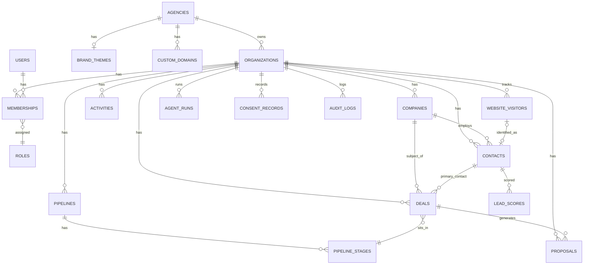

# 03 — Database Architecture

Postgres via Supabase, single project per environment, EU region. Shared schema, Row Level Security (RLS) enforced multi-tenancy. All tables use `uuid` primary keys (`gen_random_uuid()`) and `created_at`/`updated_at` timestamps (`timestamptz`).

**Deletion model — two tiers, not one.** `deleted_at` (soft-delete) is used on ordinary user-facing CRM entities (`contacts`, `companies`, `deals`, `proposals`, `activities`) for recoverable, user-initiated deletion — a "trash" model, filtered from default views but still physically present. **This is never sufficient to satisfy a GDPR erasure request.** A completed `data_subject_requests` row (`§2.8`) always performs actual hard deletion of the row, or irreversible column-level anonymization where the row must survive for referential/audit reasons (e.g., an `activities` row tied to a deal stays, but its `subject`/`body` text referencing the erased contact is overwritten, not just hidden behind `deleted_at`). Anywhere this document says "soft-delete," read it as the ordinary-use mechanism only; the compliance cascade in §2.8 and `08-Security.md` §5 governs actual erasure and is never implemented as "set `deleted_at`."

## 1. Core ERD (tenancy + CRM domain)



The full field-level ERD (all 45+ tables, including the Brain, Agent, and platform-infrastructure tables in §2.9-2.10) is generated automatically from `packages/database/schema` once implemented (Supabase CLI `db diagram` / dbdocs). This document is the authoritative source of truth until that generation pipeline exists.

## 2. Schema by Domain

Each domain grouping below is owned by the correspondingly-named package in `02-Software-Architecture.md` §4: `packages/tenancy` (Tenancy & Identity), `packages/crm`, `packages/intelligence`, `packages/automation` (Automation), `packages/revenue` (Revenue, and — filtered to the portal caller's scope — Customer Portal data access), `packages/ai-agents`, `packages/brain`, `packages/auth` (including Customer Portal session/auth), `packages/compliance`.

### 2.1 Tenancy & Identity

| Table | Key Columns | Notes |
|---|---|---|
| `agencies` | `id`, `name`, `slug` (unique), `subdomain` (unique), `plan`, `stripe_customer_id`, `status` | Root of the reseller hierarchy. `NULL` agency = platform-direct customer only exists at the `organizations` level |
| `organizations` | `id`, `agency_id` (fk, nullable), `name`, `slug` (unique), `industry`, `timezone`, `plan`, `stripe_customer_id`, `status` (`active`/`suspended`/`churned`) | The tenant. Every tenant-scoped table carries `organization_id` |
| `users` | `id` (= `auth.users.id`), `email`, `full_name`, `avatar_url`, `default_organization_id` | 1:1 with Supabase Auth identity |
| `memberships` | `id`, `user_id` (fk), `organization_id` (fk), `role_id` (fk), `status` (`invited`/`active`/`removed`) | Join table; a user can belong to multiple organizations (e.g. agency staff) |
| `roles` | `id`, `key` (`agency_owner`,`agency_admin`,`org_admin`,`org_member`,`org_viewer`,`portal_customer`), `permission_set` (jsonb) | Seeded, rarely mutated at runtime |
| `brand_themes` | `id`, `agency_id` (fk, unique), `logo_url`, `favicon_url`, `primary_color`, `secondary_color`, `accent_color`, `font_family` | Inherited by all of an agency's organizations unless overridden |
| `custom_domains` | `id`, `agency_id` (fk), `domain`, `verification_status`, `verified_at`, `ssl_status` | Supports agency vanity domains (Phase 8) |
| `api_keys` | `id`, `organization_id`, `name`, `key_hash`, `key_prefix` (`arev_live_`/`arev_test_`), `scopes` (jsonb), `created_by`, `last_used_at`, `revoked_at` | Backs the API key auth model in `04-API-Architecture.md` §3 — hashed at rest, never stored plaintext, individually revocable, scoped independently of the issuing user's own role |

### 2.2 CRM

| Table | Key Columns | Notes |
|---|---|---|
| `companies` | `id`, `organization_id`, `name`, `domain`, `industry`, `employee_count`, `annual_revenue`, `linkedin_url`, `enrichment_status`, `owner_id`, `deleted_at` | |
| `contacts` | `id`, `organization_id`, `company_id` (fk, nullable), `first_name`, `last_name`, `email`, `phone`, `job_title`, `linkedin_url`, `lifecycle_stage` (enum), `owner_id`, `deleted_at` | `email` unique per `organization_id` |
| `deals` | `id`, `organization_id`, `company_id`, `primary_contact_id`, `pipeline_id`, `stage_id`, `amount`, `currency`, `probability`, `expected_close_date`, `status` (`open`/`won`/`lost`), `owner_id`, `deleted_at` | |
| `activities` | `id`, `organization_id`, `type` (`call`/`email`/`meeting`/`note`/`task`), `related_to_type`, `related_to_id`, `subject`, `body`, `due_at`, `completed_at`, `created_by` | Polymorphic association via `related_to_type`/`related_to_id` |
| `notes` | `id`, `organization_id`, `related_to_type`, `related_to_id`, `body`, `created_by` | |
| `tags` / `taggings` | `tags(id, organization_id, name, color)`; `taggings(id, tag_id, taggable_type, taggable_id)` | Generic tagging across contacts/companies/deals |
| `pipelines` | `id`, `organization_id`, `name`, `is_default` | |
| `pipeline_stages` | `id`, `pipeline_id`, `name`, `sort_order`, `probability`, `is_won_stage`, `is_lost_stage` | |

### 2.3 Intelligence

| Table | Key Columns | Notes |
|---|---|---|
| `website_visitors` | `id`, `organization_id`, `anonymous_id`, `identified_contact_id` (fk, nullable), `first_seen_at`, `last_seen_at` | Anonymous until identification resolves a contact |
| `visitor_sessions` | `id`, `visitor_id`, `started_at`, `ended_at`, `referrer`, `utm_source/medium/campaign`, `landing_page`, `device_type` | |
| `visitor_events` | `id`, `session_id`, `event_type` (`pageview`/`form_submit`/`click`), `url`, `metadata` (jsonb), `occurred_at` | High-volume, partitioned by month once volume warrants it |
| `company_enrichment` | `id`, `company_id`, `provider`, `raw_payload` (jsonb), `technologies` (jsonb), `fetched_at`, `expires_at` | Cached per company; re-fetch gated by `expires_at` to control provider cost |
| `contact_enrichment` | `id`, `contact_id`, `provider`, `raw_payload` (jsonb), `social_profiles` (jsonb), `fetched_at`, `expires_at` | Same caching discipline as above |
| `lead_scores` | `id`, `contact_id`, `score`, `grade`, `scoring_version`, `computed_at`, `breakdown` (jsonb) | Historized — one row per computation, not upserted, for auditability of scoring drift |
| `scoring_rules` | `id`, `organization_id`, `name`, `condition` (jsonb), `weight`, `is_active` | Per-tenant configurable rules engine |

### 2.4 AI Agents

| Table | Key Columns | Notes |
|---|---|---|
| `agent_definitions` | `id`, `organization_id` (nullable = platform default persona), `key` (`sales_agent`,`marketing_agent`,`research_agent`,`scoring_agent`,`support_agent`), `system_prompt`, `model_provider`, `model_name`, `is_enabled` | Organizations can override the platform default prompt per persona |
| `agent_runs` | `id`, `organization_id`, `agent_definition_id`, `triggered_by`, `input` (jsonb), `status` (`queued`/`running`/`succeeded`/`failed`), `started_at`, `completed_at`, `error`, `total_tokens`, `total_cost_usd` | The cost/token columns back the per-persona, per-tenant cost monitoring required by `05-AI-Agent-Architecture.md` §8 — without them there is nowhere to store what that section requires be tracked |
| `agent_tool_calls` | `id`, `agent_run_id`, `tool_name`, `arguments` (jsonb), `result` (jsonb), `status`, `called_at`, `cost_usd`, `requires_human_approval` (bool), `approval_status` (`n/a`/`pending`/`confirmed`/`discarded`) | Every tool call logged for monitoring and replay; `cost_usd` captures provider-billed cost for calls like `brain.semantic_search` or `enrichment.lookup_company`, not just model token cost. For a `requires_human_approval` tool (`05-AI-Agent-Architecture.md` §1), `result` holds the *proposed* change (e.g., `{proposed_stage_id: ...}`), not a committed write — the underlying domain table is only updated by the separate human-confirm action, which updates `approval_status` on this same row rather than leaving the proposal's disposition untracked |
| `conversation_threads` | `id`, `organization_id`, `agent_definition_id` (nullable), `related_to_type`, `related_to_id`, `created_by` | |
| `chat_messages` | `id`, `thread_id`, `role` (`user`/`assistant`/`tool`), `content`, `tool_calls` (jsonb) | |
| `agent_memory` | `id`, `organization_id`, `agent_definition_id`, `scope_type` (`contact`/`company`/`deal`/`organization`), `scope_id`, `memory` (jsonb) | Strictly `organization_id`-scoped; never shared across tenants, even for the same agency. Short-term, persona-specific working state only — shared long-term context now lives in the AI Revenue Brain (§2.9, `11-AI-Revenue-Brain.md`). `company` added to the scope enum to match the Research Agent's company-scoped reasoning described in `05-AI-Agent-Architecture.md` §4 |

### 2.5 Automation

| Table | Key Columns | Notes |
|---|---|---|
| `integration_connections` | `id`, `organization_id`, `provider`, `credentials_encrypted` (bytea, pgsodium), `status`, `connected_by`, `expires_at` | Credentials encrypted at column level, never plaintext even to platform operators |
| `workflow_refs` | `id`, `organization_id`, `n8n_workflow_id`, `key`, `is_enabled`, `config` (jsonb) | Pointer from a tenant to a parameterized n8n workflow |
| `workflow_runs` | `id`, `workflow_ref_id`, `organization_id`, `triggered_by`, `status`, `started_at`, `completed_at`, `error`, `cost_usd` | `cost_usd` covers provider cost for workflows triggered directly (UI/schedule), not only via an agent — see `06-n8n-Workflow-Architecture.md` §1 |
| `email_campaigns` | `id`, `organization_id`, `name`, `subject`, `template`, `status`, `scheduled_at`, `created_by` | |
| `email_sends` | `id`, `campaign_id` (nullable), `contact_id`, `provider_message_id`, `status` (`sent`/`delivered`/`opened`/`clicked`/`bounced`/`complained`), `consent_verified` (bool), timestamps per status | `consent_verified` records that the marketing-consent check (`06-n8n-Workflow-Architecture.md` §5) actually ran before send — brings this table's auditability in line with `email_messages`/`meetings`' `consent_checked`, which previously had no equivalent here |
| `linkedin_automation_tasks` | `id`, `organization_id`, `contact_id`, `task_type` (`connect`/`message`/`view`), `status`, `scheduled_at`, `executed_at`, `risk_flag` | Isolated table set; feature-flagged per organization; `risk_flag` surfaces ToS-risk signals from n8n back to the UI |

### 2.6 Revenue

| Table | Key Columns | Notes |
|---|---|---|
| `proposals` | `id`, `organization_id`, `deal_id`, `title`, `status` (`draft`/`sent`/`viewed`/`accepted`/`declined`), `total_amount`, `currency`, `deleted_at`, timestamps | |
| `proposal_line_items` | `id`, `proposal_id`, `description`, `quantity`, `unit_price`, `sort_order` | |
| `subscriptions` | `id`, `agency_id` or `organization_id`, `stripe_subscription_id`, `plan`, `status`, `current_period_end` | Platform's own billing of agencies/orgs |
| `revenue_events` | `id`, `organization_id`, `deal_id` (nullable), `type` (`deal_won`/`subscription_charged`), `amount`, `currency`, `occurred_at` | Feeds the Revenue Dashboard |

### 2.7 Customer Portal

| Table | Key Columns | Notes |
|---|---|---|
| `portal_users` | `id`, `organization_id`, `email`, `full_name`, `auth_user_id`, `status`, `invited_by` | Separate auth scope from internal `users` — a portal user cannot authenticate into the main product. `email` unique per `organization_id`, matching the `contacts` convention |
| `portal_documents` | `id`, `organization_id`, `portal_user_id` (nullable = visible to all portal users of that org), `title`, `file_url`, `uploaded_by` | |

### 2.8 Compliance (GDPR primitives)

| Table | Key Columns | Notes |
|---|---|---|
| `consent_records` | `id`, `organization_id`, `subject_type` (`contact`/`visitor`/`portal_user`), `subject_id`, `consent_type` (`marketing_email`/`cookie_tracking`/`data_processing`/`email_content_processing`/`meeting_recording_processing`), `status` (`granted`/`withdrawn`), `source`, `ip_address`, `recorded_at` | Append-only; a withdrawal is a new row, not an update. The two Brain-related consent types are new — see §2.9 |
| `data_subject_requests` | `id`, `organization_id`, `subject_type`, `subject_id`, `request_type` (`access`/`export`/`delete`), `status`, `requested_at`, `due_at` (requested_at + 30 days), `completed_at`, `handled_by` | Drives the deletion/export orchestration job — **on `delete` completion, this always performs the hard-delete/anonymization described at the top of this document, never a `deleted_at` soft-delete.** Cascade extends into Brain tables (§2.9) |
| `audit_logs` | `id`, `organization_id` (nullable for platform-level actions), `actor_user_id`, `action`, `resource_type`, `resource_id`, `before` (jsonb), `after` (jsonb), `ip_address`, `occurred_at` | Append-only; no `updated_at`/`deleted_at` — audit logs are never mutated |
| `data_retention_policies` | `id`, `organization_id` (nullable = platform default), `data_type`, `retention_days`, `last_purge_run_at` | Drives scheduled purge Edge Functions; extended with entries for `email_messages`, `meetings`, `brain_embeddings` (§2.9) |

### 2.9 AI Revenue Brain & Extended Sources

Full design rationale in `11-AI-Revenue-Brain.md`. Requires the `pgvector` Postgres extension enabled on the Supabase project.

| Table | Key Columns | Notes |
|---|---|---|
| `brain_entity_profiles` | `id`, `organization_id`, `entity_type` (`contact`/`company`/`deal`), `entity_id`, `summary` (jsonb), `source_refs` (jsonb), `version`, `last_computed_at` | One current row per entity; continuously re-summarized from cross-source signal |
| `brain_entity_profile_history` | `id`, `profile_id` (fk), `summary` (jsonb), `version`, `computed_at` | Append-only version history for auditability of the Brain's evolving view of an entity |
| `brain_embeddings` | `id`, `organization_id`, `source_type`, `source_id`, `entity_refs` (jsonb), `chunk_text`, `chunk_index`, `embedding` (`vector(1536)`), `token_count`, `created_at` | Vector index for semantic retrieval across all ingested unstructured content. High-volume/large-payload table — see §4 partitioning note |
| `brain_knowledge_documents` | `id`, `organization_id`, `title`, `source_type` (`uploaded`/`url`), `file_url`, `content_text`, `uploaded_by` | Org-owned playbooks/product docs/pricing sheets; no third-party personal-data consent question |
| `brain_sync_state` | `id`, `organization_id`, `source_type`, `external_cursor`, `last_synced_at`, `status` | Per-tenant, per-source incremental ingestion watermark |
| `email_threads` | `id`, `organization_id`, `contact_id` (fk, nullable), `subject`, `provider`, `external_thread_id`, `participants` (jsonb), `last_message_at` | Two-way conversational email — distinct from `email_campaigns`/`email_sends` (marketing sends) |
| `email_messages` | `id`, `thread_id` (fk), `organization_id`, `direction` (`inbound`/`outbound`), `from_address`, `to_addresses` (jsonb), `body_text`, `sent_at`, `external_message_id`, `consent_checked` (bool) | `consent_checked` hard-gates Brain ingestion. High-volume/large-payload table — see §4 |
| `meetings` | `id`, `organization_id`, `related_to_type`, `related_to_id`, `provider`, `external_meeting_id`, `title`, `started_at`, `ended_at`, `participants` (jsonb), `transcript_text`, `recording_url`, `consent_checked` (bool) | Same consent-gate discipline as email. `transcript_text` is a high-volume/large-payload column — see §4 |
| `support_tickets` | `id`, `organization_id`, `contact_id` (fk), `subject`, `status` (`open`/`pending`/`resolved`), `channel` (`portal_chat`/`email`), `created_at`, `resolved_at` | Lightweight; may fold into `conversation_threads` if a fuller ticketing model proves unnecessary |

### 2.10 Platform Infrastructure

| Table | Key Columns | Notes |
|---|---|---|
| `events` | `id`, `event_type`, `event_version`, `organization_id`, `payload` (jsonb), `created_at`, `processed_at` | The outbox table backing `02-Software-Architecture.md` §5 — domain-state writes and the corresponding `events` row commit inside the same Postgres transaction (Unit-of-Work, `02` §7), never as two independent application-level writes. `event_version` allows payload shape changes without breaking existing consumers |
| `webhook_subscriptions` | `id`, `organization_id`, `target_url`, `signing_secret_encrypted`, `subscribed_events` (jsonb), `is_active`, `failure_count`, `disabled_at` | Backs tenant-configurable outbound webhooks (`04-API-Architecture.md` §7); auto-disabled (`disabled_at` set) after repeated delivery failure rather than retried indefinitely |
| `webhook_events_seen` | `id`, `provider`, `provider_event_id`, `processed_at` | Dedupe table for **inbound** provider webhooks (`/api/v1/webhooks/*`, `04-API-Architecture.md` §7) — a unique constraint on `(provider, provider_event_id)` is what makes retried provider deliveries idempotent; distinct from the `events` outbox above, which is this platform's own outbound domain-event fan-out, not inbound provider receipt |

## 3. Relationships Summary

- `agencies (1) → organizations (N)` — a reseller owns many client orgs; `agency_id` nullable for direct customers.
- `organizations (1) → memberships (N) ← users (N)` — many-to-many between users and organizations through `memberships`, carrying the role.
- `organizations (1) → api_keys (N)` — API keys are always organization-scoped, never agency-wide, even when issued by agency staff on behalf of a client org.
- `organizations (1) → companies/contacts/deals (N)` — the core tenant-scoping relationship repeated across every domain table.
- `companies (1) → contacts (N)`, `companies (1) → deals (N)` — optional company association (contacts/deals can exist without a company).
- `pipelines (1) → pipeline_stages (N) ← deals (N)` — deals reference a stage, stages belong to a pipeline, pipelines belong to an organization.
- `contacts (1) → lead_scores (N)` — historized one-to-many, not a single mutable score field.
- `website_visitors (0..1) → contacts (1)` — a visitor may or may not resolve to an identified contact.
- `deals (1) → proposals (N)` — a deal can have multiple proposal versions/revisions.
- `agent_definitions (1) → agent_runs (N) → agent_tool_calls (N)` — full audit trail of what an agent did, which tools it called, and at what cost.
- Polymorphic associations (`activities`, `notes`, `taggings`, `agent_memory` scope) use `related_to_type` + `related_to_id` rather than a separate join table per entity type, to avoid table proliferation — enforced at the application layer, not by a DB foreign key (Postgres has no native polymorphic FK).
- `brain_entity_profiles (1) → brain_entity_profile_history (N)` — current profile plus its full version history.
- `brain_embeddings.entity_refs` (jsonb array) → `contacts`/`companies`/`deals` — many-to-many by nature (one email or transcript chunk can reference multiple entities), so it is deliberately not a strict FK; resolved and permission-filtered at query time by `packages/brain` (`11-AI-Revenue-Brain.md` §5).
- `email_threads (1) → email_messages (N)`; `contacts (0..1) → email_threads (N)`.
- `meetings`/`support_tickets` associate to `deals`/`contacts`/`companies` polymorphically, same pattern as `activities`.
- `organizations (1) → webhook_subscriptions (N)`; `events` rows are fanned out to matching `webhook_subscriptions` by the outbox dispatcher (`02-Software-Architecture.md` §5), not queried directly by the receiving tenant.

## 4. Indexing Strategy

- **Every tenant-scoped table**: composite index leading with `organization_id` — e.g. `(organization_id, created_at)` for list views, `(organization_id, email)` unique for `contacts`.
- **Foreign keys**: all FK columns indexed by default (Postgres does not auto-index FKs) — `company_id`, `contact_id`, `deal_id`, `agent_run_id`, etc.
- **High-cardinality lookup columns**: `contacts.email`, `companies.domain`, `agencies.slug`/`subdomain`, `organizations.slug`, `api_keys.key_hash` — unique indexes.
- **JSONB columns queried by key** (`visitor_events.metadata`, `scoring_rules.condition`): GIN indexes added only once a specific query pattern justifies it — not speculatively on every jsonb column.
- **High-volume append-only tables**: `visitor_events`, `audit_logs`, `agent_tool_calls`, `events` (the outbox) index on `(organization_id, occurred_at)` / `(organization_id, created_at)` to support time-windowed queries and retention purges. **`brain_embeddings`, `email_messages`, and `meetings`** are the nearest-term partitioning candidates specifically — they combine high row-growth potential (Phase 5 email/meeting ingestion) with large payload columns (`chunk_text`, `body_text`, `transcript_text`), which is exactly the profile that degrades shared-instance performance first; this mirrors the pgvector revisit-trigger already named in `02-Software-Architecture.md` §6. None of this is partitioned at MVP scale — named here so it isn't rediscovered under production load.
- **Soft-delete filtering**: partial indexes `WHERE deleted_at IS NULL` on frequently-listed CRM tables (`contacts`, `companies`, `deals`, `proposals`) to keep the common-case index small.
- **Vector similarity search** (`brain_embeddings.embedding`): an HNSW (or IVFFlat, benchmarked at implementation time) `pgvector` index, always combined with a leading `organization_id` filter — the vector index accelerates similarity ranking, it does not replace tenant scoping, which remains enforced by RLS underneath it regardless of index choice.

## 5. Row Level Security Strategy

RLS is enabled on every tenant-scoped table. Baseline policy pattern:

```sql
alter table contacts enable row level security;

create policy "tenant_isolation_select" on contacts
  for select using (organization_id = current_org());

create policy "tenant_isolation_write" on contacts
  for all using (organization_id = current_org())
  with check (organization_id = current_org());
```

**Tenant-context resolution — one mechanism, every caller type.** `current_org()`, `current_agency()`, and `current_role_key()` are `security definer` SQL functions that read from a **request-scoped Postgres session setting** (`set_config('app.current_org', ..., true)`, transaction-local), populated by a single piece of API middleware at the start of every request — not baked into a static JWT claim at session start. This one mechanism serves every caller type identically:
- **JWT-session users**: middleware resolves the org the user is currently acting as (from the request path/header, validated against their `memberships`) and sets it for that request. Switching organizations in the UI (e.g., an agency admin entering a client org, `07-UI-UX-System.md` §6) takes effect on the very next request — there is no stale-JWT-claim problem, because the claim isn't where this is read from.
- **API-key callers**: middleware resolves the key's bound `organization_id` (§2.1 `api_keys`) and sets it identically.
- **n8n**: the same middleware path validates the workflow's `api_keys` row (scoped to a `service` role, `04-API-Architecture.md` §3) and sets the org it's authorized for — n8n never receives elevated or unscoped database access; it is subject to exactly the same per-request tenant resolution as any other caller.

**Agency roll-up access** is never implemented as "agency role bypasses RLS." Instead, a separate set of read-only views (`agency_rollup_contacts`, `agency_rollup_deals`, etc.) is defined as:

```sql
create view agency_rollup_deals as
  select d.* from deals d
  join organizations o on o.id = d.organization_id
  where o.agency_id = current_agency()
    and current_role_key() in ('agency_owner', 'agency_admin');
```

Named `current_role_key()`, not `current_role()` — implemented this way in M1.2 specifically to avoid ambiguity with PostgreSQL's own SQL-standard `CURRENT_ROLE` construct (see ADR-003).

This keeps the blanket cross-org read path explicit, named, and auditable — a bug in the base `contacts`/`deals` policy can never silently leak cross-client data, because the roll-up path is structurally separate.

**Service-role bypass**: only Edge Functions running scheduled/system jobs (retention purges, scoring recalculation, the outbox dispatcher) use the Supabase service role, and only inside narrowly-scoped functions that still set `app.current_org` per tenant as they iterate — never as a blanket unscoped bypass, and never from application request handlers.

## 6. Multi-Tenancy Strategy

- **Model**: shared schema, shared Postgres instance, RLS-enforced isolation, two-level tenancy (`agencies` → `organizations`). See ADR-003 (`02-Software-Architecture.md`) for the rationale versus schema-per-tenant/DB-per-tenant.
- **Tenant resolution**: every request — JWT session, API key, or n8n's `service`-role `api_keys` credential alike — resolves to an authorized `organization_id` via the single request-scoped mechanism in §5, never from a client-supplied parameter alone, to prevent tenant-spoofing.
- **Cross-tenant operations** (agency roll-ups, platform admin) are implemented as explicit, separately-reviewed code paths and DB views — never a generic "superuser" flag checked ad hoc in application code.
- **Escape hatch for large tenants**: if a future enterprise tenant requires dedicated infrastructure (compliance mandate, noisy-neighbor performance isolation), the plan is a dedicated Postgres database provisioned for that one `organization_id`, with the same schema — not a redesign. This is documented as a future option, not built speculatively.
- **Tenant lifecycle**: organizations move through `active` → `suspended` (non-payment, still queryable by owner/support) → `churned` (soft-deleted, data retained per `data_retention_policies` before hard deletion). This same two-stage model — recoverable soft-state first, real hard-deletion later on a defined schedule — is the pattern this entire document follows for GDPR-driven erasure too (see the deletion-model note at the top); organization churn was already implemented correctly, it just wasn't stated as the general rule until now.
